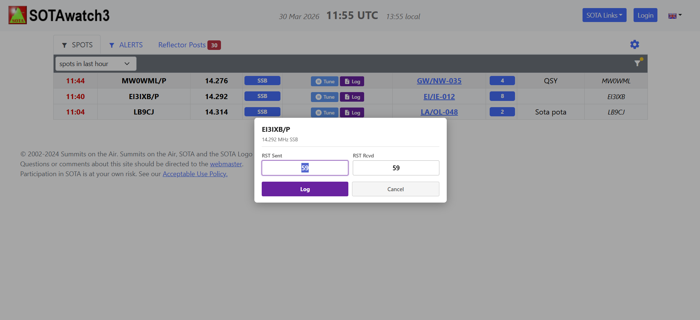

# SOTA Hunter

**Ein Klick zum Abstimmen. Ein Klick zum Loggen. SOTAwatch nie verlassen.**

SOTA Hunter ist eine Chrome-Erweiterung, die **Tune**- und **Log**-Schaltflächen direkt in die [SOTAwatch3](https://sotawatch.sota.org.uk/)-Spotstabelle einfügt — damit du eine Gipfelaktivierung arbeiten kannst, ohne die Tastatur anzufassen oder das Fenster zu wechseln.

---

## Vorher / Nachher

| Ohne SOTA Hunter | Mit SOTA Hunter |
|---|---|
|  |  |

---

## Was beim Klicken passiert

### Tune (blauer Button)
Stellt Frequenz und Betriebsart deines **Yaesu-Radios** mit einem Klick per direktem seriellen CAT ein — keine Zwischensoftware, keine CAT-zu-TCP-Brücken.

Das richtige Seitenband wird automatisch gewählt:
- SSB → LSB unterhalb 7,3 MHz, USB darüber
- FT8 / FT4 / JS8 / DATA → DATA-U
- CW, FM, AM werden unverändert übernommen

### Log (lila Button)
Öffnet einen kurzen RST-Dialog und sendet dann einen **vollständigen ADIF-QSO-Datensatz** per UDP an das HRD Logbook — genau das gleiche Protokoll wie WSJT-X, sodass keine zusätzliche Konfiguration außer der Aktivierung der QSO-Weiterleitung in HRD erforderlich ist.



Der geloggte Datensatz enthält Rufzeichen, Frequenz, Band, Betriebsart, **SOTA_REF**, Gipfelname und Höhe (live von der SOTA-API abgerufen) sowie dein Stationsrufzeichen und Locator.

---

## Funktionen auf einen Blick

| Funktion | Details |
|---|---|
| Direktes CAT-Abstimmen | 8 Yaesu-Modelle unterstützt — Baudrate wird automatisch gesetzt |
| Automatische COM-Port-Freigabe | Serieller Port wird freigegeben, wenn der SOTAwatch-Tab geschlossen wird |
| HRD Logbook-Integration | UDP ADIF auf Port 2333 — wie WSJT-X/JTDX |
| Aktivierer-Deduplizierung | Zeigt nur den neuesten Spot pro Aktivierer — weniger Unübersichtlichkeit |
| Gipfelanreicherung | Ruft Name & Höhe von der SOTA-API ab, wird gecacht |
| RST-Dialog | Vorausgefüllt 59/599/+00 je nach Betriebsart, vor dem Senden bearbeitbar |
| Visuelle Rückmeldung | Orange → ausstehend, Grün → Erfolg, Rot → Fehler mit Tooltip |
| Einstellungs-Popup | Radio-Dropdown, COM-Port, Rufzeichen, Locator, Log-Port und Verbindungstest |

---

## Unterstützte Radios

Aktuell werden alle Yaesu-Radios mit dem Standard-ASCII-CAT-Protokoll unterstützt. Modell im Einstellungs-Popup auswählen — die richtige Baudrate wird automatisch eingetragen.

| Radio | Standard-Baudrate | Anschluss |
|---|---|---|
| FT-DX10 | 38400 | USB (Silicon Labs CP2105) |
| FTX-1 | 38400 | USB (Silicon Labs CP2105) |
| FT-710 | 38400 | USB (Silicon Labs CP2105) |
| FTDX101MP/D | 38400 | USB + RS-232C |
| FT-991A | 4800 | USB (Silicon Labs CP210x) |
| FT-891 | 9600 | USB (Silicon Labs CP210x) |
| FTDX3000 | 4800 | RS-232C (USB-Adapter erforderlich) |
| FTDX1200 | 4800 | RS-232C + USB |

**Custom / Other** verwenden für nicht aufgelistete Yaesu-Radios — Baudrate dann manuell eintragen (typische Werte: 4800, 9600, 38400).

---

## Voraussetzungen

- **Windows** + **Google Chrome**
- **Python 3.6+** mit `pyserial` — per `python --version` und `pip install pyserial` in der Eingabeaufforderung prüfen
- **Yaesu-Radio** (siehe Unterstützte Radios) via USB oder RS-232C angeschlossen
- **HRD Logbook** (optional) mit aktivierter UDP-QSO-Weiterleitung auf Port 2333

---

## Schnelleinrichtung

### 1 — Native Host registrieren
`native-host\install.bat` doppelklicken. Dies schreibt einen Registry-Schlüssel, damit Chrome die Python-Bridge findet.

### 2 — Erweiterung laden
1. `chrome://extensions/` öffnen
2. **Entwicklermodus** aktivieren
3. **Entpackt laden** klicken → Ordner `extension/` auswählen
4. Die auf der Karte angezeigte Erweiterungs-ID notieren (32 Kleinbuchstaben, z.B. `abcdefghijklmnopqrstuvwxyzabcdef`)

### 3 — Native-Host-Manifest konfigurieren
Vorlage kopieren:
```
native-host\com.sotahunter.bridge.json.template  →  native-host\com.sotahunter.bridge.json
```
Die `.json`-Datei öffnen und einstellen:
```json
"path": "C:\\Users\\DeinName\\SOTA_Hunter\\native-host\\bridge.bat",
"allowed_origins": ["chrome-extension://DEINE_ERWEITERUNGS_ID/"]
```

### 4 — Einstellungen konfigurieren
SOTA Hunter-Toolbar-Symbol klicken, um das Einstellungs-Popup zu öffnen:


- **Radio Model** — eigenes Radio auswählen; Baudrate wird automatisch eingetragen
- **COM Port** — serieller Port des Radios (im Geräte-Manager nachschauen)
- **My Callsign / Grid Square** — werden in jeden geloggten QSO-Datensatz aufgenommen
- **HRD Log Port** — UDP-Port für HRD Logbook (Standard: 2333)

**Test Connection** klicken, um die Verbindung zum Radio zu prüfen.

### 5 — HRD QSO-Weiterleitung aktivieren (für Log)
HRD Logbook → **Tools → Konfigurieren → QSO-Weiterleitung** → *"QSO-Benachrichtigungen per UDP von anderen Anwendungen empfangen (WSJT-X)"* aktivieren.

---

## Fehlerbehebung

| Symptom | Lösung |
|---|---|
| Tune-Button wird rot | COM-Port in den Einstellungen prüfen; **Verbindung testen** verwenden; `native-host\bridge.log` prüfen |
| Log-Button wird rot | Prüfen ob HRD Logbook läuft und UDP-Weiterleitung aktiviert ist |
| Keine Buttons erscheinen | SOTAwatch neu laden; `chrome://extensions/` auf Fehler prüfen |
| „Verbindung zum Native Host nicht möglich" | `install.bat` erneut ausführen; `.json`-Manifest auf korrekten Pfad und Erweiterungs-ID prüfen; Chrome neu starten |

---

## Architektur

```
SOTAwatch DOM → content.js → background.js → bridge.py → cat_client.py  → Yaesu-Radio (CAT)
                                                        → adif_logger.py → HRD Logbook (UDP)
```

Chrome startet die Python-Bridge bei Bedarf automatisch — kein manueller Prozessstart, keine offenen localhost-Ports.

---

## Lizenz

MIT — siehe [LICENSE](LICENSE).

---

*73 de DM6LE — gebaut für Chaser, die beim seltenen Gipfel nicht am VFO-Knopf fummelm wollen.*
